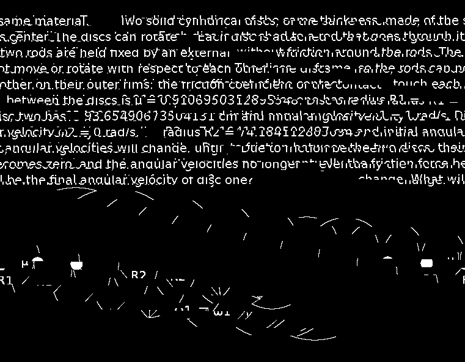

# cat_img puzzle write-up

This puzzle was first released publicly by /u/cornwarecjp on the [/r/bitcoinpuzzles](https://www.reddit.com/r/bitcoinpuzzles/) subreddit with a [post](https://www.reddit.com/r/bitcoinpuzzles/comments/818m4l/expert_more_than_1mbtc_puzzle/) on March 1st, 2018.  He revealed little information, including not specifying the Bitcoin wallet address containing the prize as it was part of the puzzle.  On April 1st, 2018, cornwarecjp began answering questions once a day about the puzzle using a [creative proof-of-work system](http://qa.ultimatestunts.nl/) to nominate the next one asked.  The puzzle was first solved by a team assembled on the [Crypto_Puzzles](https://discord.gg/bRtRm8m) Discord server consisting of Cr0wn_Gh0ul, cyzorb (myself), nieods, and RRotenburg. Solving it required several steps outlined here from our perspective as solvers:

1) cat image
============

No other information was given besides this image:

along with a link to the original unmodified [source](https://www.flickr.com/photos/tehchix0r/14984044714/).  The first step is a standard steganography technique of hiding information within the least visible bits of an existing image, such that the data is not apparent unless you know to look for something.  In more detail (feel free to skip ahead if you are familiar with this), for each pixel of a digital image color is encoded as three 8-bit values (red,blue,green) where higher amounts correspond to more of that color, ranging from 0 to 255, such that (0,0,0) is black and (255,255,255) is white.  In binary, 255 is 11111111, or 8 bits set to 1.  For example, if you had a completely white image you could hide some data in binary form (ex. 0111010101...) one bit at a time within the red plane by moving pixel-by-pixel from the top left pixel and going left to right, then top to bottom, and setting the least significant bit (LSB) of the 8-bit red value to the current binary value (effectively not changing it if the same value):

    0 -> (11111110,11111111,11111111) -> (254,255,255)
    1 ->  (11111111,11111111,11111111) -> (255,255,255)

Various tools exist to analyze messages encoded this way, for example [zsteg](https://github.com/zed-0xff/zsteg), though it can be done  with a home-made python script as well.  Here in the cat image, within the LSB of green color plane (zsteg -E 1b,g,lsb,xy) was the message, "You're on to something:" preceding a zipped file that contained a python program, [amaze.py](amaze.py)

2) python maze
==============

After unzipping the python program and looking at the code it becomes apparent that it deterministically generates a three-dimensional maze within a cube that you can solve by entering the correct series of steps to get from one corner to the opposing one.  Each step moves two spaces within the maze and is entered as an integer:

    0 = move X+
    1 = move X-
    2 = move Y+
    3 = move Y-
    4 = move Z+
    5 = move Z-

Within the program, if you enter in a valid series of steps that solve the maze, it XORs the steps with a mask array to generate the final output.

One successful approach to solve this is to write a [maze solving program](maze_solver.py) that algorithmically determines the solution by.  Alternatively, given the source code, it can be [modified](amaze_print.py) to print out the maze and then be solved by hand.  In either case, the correct series of 105 steps is: `22021243333044042422430255240252153312502115150043534053024342251204424113434034050304140020352242252140` which leads to a Tor-accessible onion URL as the next step in the puzzle: http://gbhfpixmagkbskmo.onion/

3) SHA-256 in brainfuck
=======================

This step was challenging in a way unlike most puzzles as it was clear what the instructions were, but the solution required programming work rather than quick insight1.  The website given is a fairly blank page, containing space to submit a program along with the previously run input data and SHA-256 hash output, implying that a successful program is one that performs the SHA-256 hashing algorithm on 256 bits of data.  Here is a diagram that depicts the rough outline of a hash cycle, where this must be done 64 times:

2

Though not particularly tricky to program in a standard programming language with access to a number of built-in functions, the caveat here was that the program had to be written in [brainfuck](https://esolangs.org/wiki/Brainfuck).  Besides the limitation in commands and memory, most implementations (including this one) use 8-bit cells whereas SHA-256 performs operations on 32-bit integers.

There are broadly two approaches we considered - one being to program either directly in brainfuck or through using tools that expedite writing the commands, and another in writing SHA-256 in another programming language (such as C) that can be then converted to brainfuck.  One successful approach we used was done with the [brainfuck-macros](https://github.com/cornwarecjp/brainfuck-macros) package (repo created by the puzzle author himself) that allows for easy writing and reuse of brainfuck functions along with stack memory and recall of cell position in generating output brainfuck code.  Developing the [final brainfuck code](sha256_v5.bf) was done primarily in a [brainfuck-macros script](sha256_v5.bfm), with additional short python scripts to autogenerate the commands corresponding to each message value (Wn), constant (Kn and Hn), and hash cycle.  This implementation writes everything in little-endian binary along with two flags to inform end conditions of loops, such that every number uses 34 memory cells.  Several steps are excluded (notably input message length detection and correspondingly dynamic padding) on the basis of known input size.

There are two clear constraints on a working program that became clear through testing the website and corresponding values in another package written by the creator, [brainfuck-compiler-interpreter](https://github.com/cornwarecjp/brainfuck-compiler-interpreter): it must be less than 1m brainfuck commands and take less than 1b instructions during runtime.  However, there is a third constraint that later became clear2 in that the program must successfully convert and compile in C on a Raspberry Pi.  This latter constraint seems to require brainfuck code that is somewhere south of 600k commands with this approach, though it is probably also dependent on the efficiency of particular brainfuck conversion C code going into compilation.

A correctly working program allowed you access the next site: http://gbhfpixmagkbskmo.onion/2d7e473fae0c3fb887c5906166ee107a8dd49627218f6159bbdc46d35026eae1.html

4) "Enter the value" - physics problem #1
=========================================

The page has text, "Enter the value in standard SI units (meter, kilogram, volt, radians, kelvin, ...). ", and a submission box that - in JavaScript - takes input and checks its hash against three possible outputs and if matching, XORs multiple hashes against a mask array.  Given little else to go on (and later, hints from the Q&A page) searching the cat image revealed more embedded secrets.  Particularly, the inverse of red LSB values (zsteg --invert -E 1b,r,lsb,xy) seemed very similar to green LSB values but with slight alterations relative to the known zipped python program. XORing the green and red LSB and wrapping at a bitstream width of 761 produces a diagonally wrapped text image:

containing a [physics problem](physics_problem_1.txt).

It is a problem of two disks on parallel frictionless rods, initially with one spinning while the other is at rest, brought together at the rims and allowed to reach equilibrium.  One can [calculate](https://physics.stackexchange.com/questions/231811/spinning-disk-touches-stationary-disk) the final angular velocity of the first disk by using conservation of angular momentum, knowing that the final angular velocity of both disks will be the same and relative moment of inertias are proportional to radius squared given identical thickness and density (the provided coefficient of friction is uneeded to solve):

    (I1+I2)wf = I1w0
    wf = (I1)/(I1+I2)w0
    = (R12/(R12+R22))w0
    = 0.93654906735041312/(0.74164112805094972+0.93654906735041312)
    = 0.6145959717

When this value is entered into the "Enter a value" page it outputs a 32-byte hex string: `37107599e317f32f53e58571c857a45a4e1d1d88a46ae4983d3160f9962f5c0a`

5) QR code
==========

At this point we figured there must be more in the cat image as though the hex string is the right size for a private key, is for an empty Bitcoin wallet. More digging revealed that XORing the blue and green LSB also seemed to generate some repetitive, non-random information, with columns of consistent bits when viewed at a bitstream width of 416:

.

The data seemed to be 8-bit in nature, with only 6 different values used and two of them (values of 13 and 10) only and always occurring at the end of the 416 bitstream width wrapped image.  As these corresponded to ASCII for CR+LF it seemed likely they indicated the end of a 52 character line in ASCII, with one of the other values (32) corresponding to spaces in the text.  The last three values (219, 220, and 223) are not often used, but are commonly seen in text files accompanying pirated/cracked software where they translate to blocks for ASCII art.

When viewed correctly ([here](bxg2a_blocks.txt) translated to unicode characters \u+2580, \u+2584, and \u+2588) it produces a scannable QR code:

with contained Bitcoin script as data:

    P2SH: OP_HASH160 1LGLVoSNni64DNP8pnZZxZSEdk2rbJ8s4J OP_EQUALVERIFY OP_DUP OP_HASH160 1KseMAwvPwhJQyUxmBPcK99s7wy7qGvdfa OP_EQUALVERIFY OP_CHECKSIG

6) "Enter the value" - physics problem #2
=========================================

The given information from the QR code is a P2SH bitcoin script that would allow one to perform a transaction from the address' stored BTC if one knows the input values, x and y, that hash to the two strings (with version byte and appending 8-byte checksum) as:

    OP_HASH160(x) = 00 + RIP160(SHA256(x)) + checksum(SHA256(SHA256(00+RIP160(SHA256(x))))) = 1LGLVoSNni64DNP8pnZZxZSEdk2rbJ8s4J
    OP_HASH160(y) = 00 + RIP160(SHA256(x)) + checksum(SHA256(SHA256(00+RIP160(SHA256(x))))) = 1KseMAwvPwhJQyUxmBPcK99s7wy7qGvdfa

The hex string obtained from the first physics problem, when used as an ECDSA private key, is associated with a public key that hashes to the second value, `041fbdcaa215003932de41bd382e36a2931adedd89a66b4902b88486136c48044f124c246cd1fe12e3c1cc6c619508bdf4732daaaacf5f7ecc9eb9ae0dd586318b`

Hashing the P2SH script above generates the corresponding address, `3HvRbQU3CNVSasRpdLwRWp8WAhhhfmNriE`, which was the prize location of 0.25 BTC. Examining the [funding transaction](https://blockchain.info/tx/1b36b1487563bc08a2a2326a6412924d52f15fe7cbd47140d1c4c790ef3fbb65) revealed another physics puzzle:

    "Resistance of knight move in infinite 2D rectangular grid of 1 Ohm resistors"

[The answer](https://www.mbeckler.org/resistor_grid/) to this problem of `0.7732395447` can be entered into the "Enter a value" page3 to give a different output: a hex string that translates to an incomplete quote from the bible (Matthew 6:19):

    446f6e27742073746f726520757020747265617375726573206f6e20656172746821204d6f74687320616e6420727573742063616e2064657374726f79207468656d2c20616e6420746869657665732063616e20627265616b20696e20616e00000000000000000000000000

    Don't store up treasures on earth! Moths and rust can destroy them, and thieves can break in an

Specifically, this quote is from the [Contemporary English Version (CEV) translation](https://www.biblegateway.com/passage/?search=Matthew%206:18-20&version=CEV) and when the hex is correctly completed, gives the input needed for the first OP_HASH160 operation: `446f6e27742073746f726520757020747265617375726573206f6e20656172746821204d6f74687320616e6420727573742063616e2064657374726f79207468656d2c20616e6420746869657665732063616e20627265616b20696e20616e6420737465616c207468656d2e`

7) Final transaction
====================

Lastly, the [raw transaction](final_transaction.txt) (also as [JSON](508b661820602521024041c8486ba72840130aafd5eb7128b37ffe017db41546.json)) needed to be written that successfully transfers the BTC to a wallet we controlled.  The transaction can be seen [here](https://blockchain.info/tx/508b661820602521024041c8486ba72840130aafd5eb7128b37ffe017db41546).

Overall this puzzle surprised us all quite a bit with its complexity given the rather innocuous image as a starting point, even with the Expert tag.  The one last bit of the puzzle never made clear to us was the third value on the "Enter the value" page - perhaps a brute-force trap for those without the QR code yet?  We'd like to thank cornwarecjp for the detailed puzzle - we had a great time working together to solve it!  And we invite anyone interested in these sorts of puzzles to the [Crypto_Puzzles](https://discord.gg/bRtRm8m) Discord!

1 It is worth mentioning that this step was nearly circumvented by a clever exploit from Cr0wn_Gh0ul, wherein he found the original temporary storage location for compiled brainfuck programs.  Upon submission of a working program, it could have been possible to decompile to C source code and then convert to brainfuck given knowledge of the brainfuck compiler being used.
2 Khalil, M., Nazrin, M. and Hau, Y.W., 2008, December. Implementation of SHA-2 hash function for a digital signature System-on-Chip in FPGA. In Electronic Design, 2008. ICED 2008. International Conference on (pp. 1-6). IEEE.
3 The same exploit attempt also informed us on the machine type being used to run the website backend.
4 We technically brute-forced the second value, but explain above the non-brute-force way of solving for the value.
